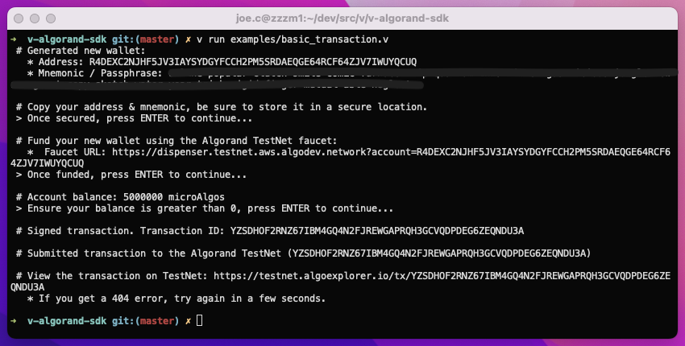

# v-algorand-sdk

Based Off: https://godoc.org/github.com/algorand/go-algorand-sdk

The Algorand golang SDK provides:

- HTTP clients for the algod (agreement) and kmd (key management) APIs
- Standalone functionality for interacting with the Algorand protocol, including transaction signing, message encoding, etc.

# Documentation

Until V specific documentation exists you may look at the go documentation [on godoc](https://godoc.org/github.com/algorand/go-algorand-sdk).

Additional developer documentation and examples can be found on [developer.algorand.org](https://developer.algorand.org/docs/sdks/go/)

# Examples

## examples/basic_transaction.v
demonstrates creating a new account (wallet & mnemonic) and submitting a transaction to the Algorand testnet

 - Setup an Algorand node (https://developer.algorand.org/docs/run-a-node/setup/install/)
 - You will choose a data directory when installing the default is `~/.algorand`
 - Start your node `goal node start -d ALGORAND_DATA_DIR`
 - Replace `algod_token` in `examples/basic_transaction.v` with the contents of `ALGORAND_DATA_DIR/algod.token`
 - You may also change the destination address, amount to send (make sure its no more than 5 Algo) etc.
 - Install v msgpack module: `v install msgpack`
 - Clone this repo: `git clone https://github.com/joe-conigliaro/v-algorand-sdk algorand`
 - Symlink the algorand module to `~/.vmodules`: `ln -s /full/path/to/algorand/src/algorand ~/.vmodules/algorand` 
 - You can now run `examples/basic_transaction.v`:
    * Running it will walk you through submitting a transaction `v run algorand/examples/basic_transaction.v`
    * Verify the transaction was submitted to testnet `https://testnet.algoexplorer.io/tx/TRANSACTION_ID`

# Status

Many features are not implemented yet. Rest assured this is being actively developed.
